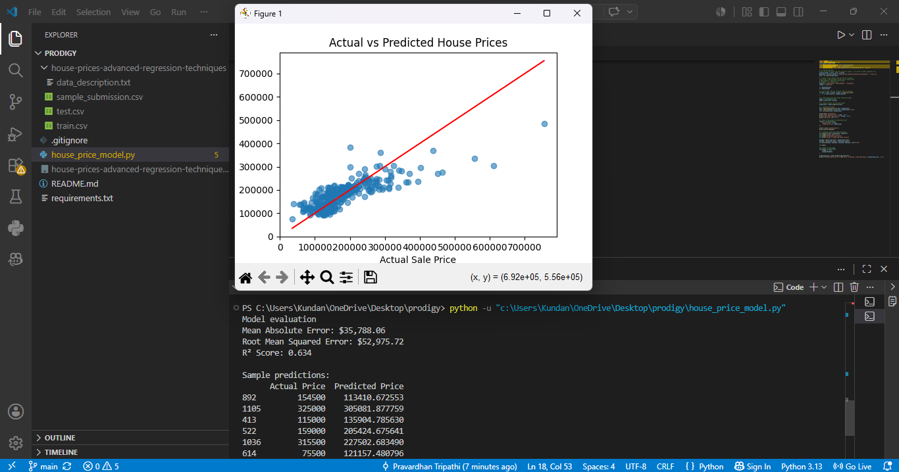

# House Price Prediction

This project is my first machine-learning internship task at Prodigy InfoTech. It uses a **Linear Regression** model to predict a house's sale price.

## What the model uses

- Above-ground living area (`GrLivArea`)
- Number of bedrooms (`BedroomAbvGr`)
- Number of full bathrooms (`FullBath`)

## Dataset

The project uses the **House Prices: Advanced Regression Techniques** dataset from Kaggle:

https://www.kaggle.com/competitions/house-prices-advanced-regression-techniques/data

Download and extract the dataset so this file exists:

```text
house-prices-advanced-regression-techniques/train.csv
```

## How to run the project

1. Install the required packages:

   ```powershell
   pip install -r requirements.txt
   ```

2. Run the model:

   ```powershell
   python house_price_model.py
   ```

The program prints model evaluation values and shows a chart that compares actual house prices with predicted prices.

## Results

Using an 80% training and 20% testing split, this model achieved approximately:

- Mean Absolute Error: **$35,788**
- Root Mean Squared Error: **$52,976**
- R² Score: **0.634**

## Libraries

- pandas
- scikit-learn
- matplotlib

- 
- ## Model Output


